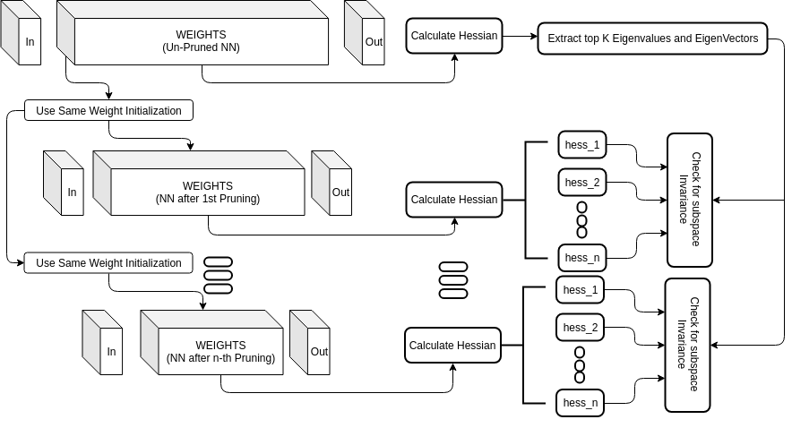

# Invariance Between Subspaces []() []() []() 


## Flowcharts


*Fig 1: Flowchart of Invariance Baseline*

------------------------------------------------



*Fig 2: Flowchart of Invariance in Lottery Ticket Hypothesis*

------------------------------------------------


## Requirements
- To install requirements, `pip install -r requirements.txt`.


## To Replicate Results
- For Invariance baseline, run `baseline.py`.
- For Invariance in Lottery Ticket Hypothesis, run `lottery_ticket.py`.
- For Invariance layerwise, run `layerwise.py`

## Repository Structure
```bash
Invariance-between-subspaces
├── baseline.py
├── lottery_ticket.py
├── layerwise.py
├── data.py
├── README.md
├── requirements.txt
├── results
│   ├── baseline
│   ├── layerwise
│   └── lottery_ticket
├── readme_assets
│   ├── baseline.png
│   ├── layerwise.png
│   └── lottery_ticket.png
└── model
    ├── abstractmodel.py
    ├── forward.py
    ├── fullconn.py
    ├── __init__.py
    └── logreg.py
```


## Issue / Want to Contribute ? :
Open a new issue or do a pull request incase your are facing any difficulty with the code base or you want to contribute to it.

[](https://github.com/rahulvigneswaran/Invariance-between-subspaces/issues/new)